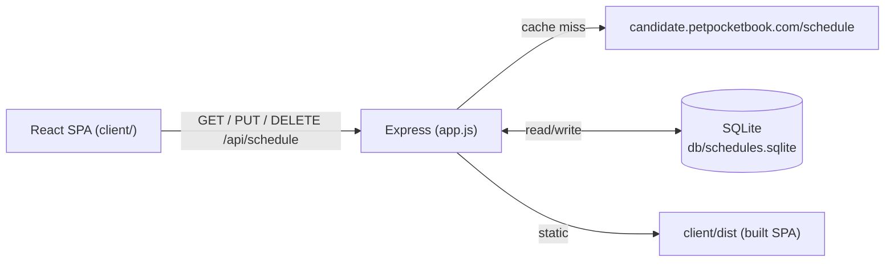

## Architecture



One process, single origin. SQLite is keyed by `YYYY-MM-DD`; cache-miss days are seeded from the upstream call and saved.

## Branch + housekeeping

- New branch: `feat/scheduler`.
- Add `db/`, `client/dist/`, `client/node_modules/` to `.gitignore`.
- Delete the unused `routes/users.js` mount and the `Welcome to Express` Jade view.

## Backend (Express)

- `[lib/db.js](lib/db.js)` — initializes SQLite at `db/schedules.sqlite` with:
  ```sql
  CREATE TABLE IF NOT EXISTS schedules (
    date TEXT PRIMARY KEY,
    appointments TEXT NOT NULL,
    updated_at TEXT NOT NULL
  );
  ```
  Exposes `getSchedule(date)` and `upsertSchedule(date, appointments)` returning promises.

- `[lib/petPocketbook.js](lib/petPocketbook.js)` — `fetchUpstreamSchedule()` calls `https://candidate.petpocketbook.com/schedule?api_key=jQkI63suJhqd3DtL` (key read from `process.env.PETPOCKETBOOK_API_KEY` with a default), normalizes each appointment to `{ id: uuid(), pet: { name, type }, time }`. Uses Node 18+ global `fetch` (no new dep).

- `[routes/schedule.js](routes/schedule.js)` — new router:
  - `GET /api/schedule?date=YYYY-MM-DD` → returns stored row, or on miss fetches upstream, persists, returns it.
  - `PUT /api/schedule?date=YYYY-MM-DD` body `{ appointments }` → validates shape (each appointment has `id`, `pet.name`, `pet.type` in the allowed enum, `time` in the 30-min grid 8:00 AM–6:00 PM), upserts, returns the saved row. Used for drag-to-move (full-day replace).
  - `DELETE /api/schedule/:appointmentId?date=YYYY-MM-DD` → loads the day, removes the appointment whose `id` matches, upserts, returns the updated row. 404 if the appointment id isn't found for that date. Used for drag-to-trash.
  - 400 on bad input (missing/invalid `date`, malformed body, unknown pet type, off-grid time); 404 on missing appointment for DELETE; 502 on upstream failure.

- `[app.js](app.js)` — mount `/api/schedule`; in production serve `client/dist` and fall back to `client/dist/index.html` for unknown GETs (SPA routing). Drop the Jade view engine.

## Frontend (React + Vite SPA in `client/`)

- New `[client/package.json](client/package.json)` with `react`, `react-dom`, `@dnd-kit/core`, `vite`, `@vitejs/plugin-react`. (No `@dnd-kit/sortable` — no in-slot ordering requirement.)
- `[client/vite.config.js](client/vite.config.js)` — dev server on 5173 with proxy `/api -> http://localhost:3000`; build output to `client/dist`.
- `[client/src/api.js](client/src/api.js)` — `getSchedule(date)`, `saveSchedule(date, appointments)` (PUT), `deleteAppointment(date, appointmentId)` (DELETE).
- `[client/src/lib/time.js](client/src/lib/time.js)` — TIME_SLOTS array `['8:00 AM', '8:30 AM', ..., '6:00 PM']` (21 slots), `formatDate(date)`, `addDays(date, n)`.
- `[client/src/hooks/useIsMobile.js](client/src/hooks/useIsMobile.js)` — `matchMedia('(max-width: 768px)')` hook used to **conditionally not render** `Sidebar`/`TrashZone` on mobile (per the README "no trash on mobile" requirement). CSS hiding alone is insufficient because `@dnd-kit` registers droppables regardless of visibility.
- Components in `[client/src/components/](client/src/components/)`:
  - `Header.jsx` — prev/next arrows, date label, calendar icon (mobile only) opening a `<input type="date">` sheet.
  - `Sidebar.jsx` — desktop-only (rendered only when `useIsMobile()` is false), contains `TrashZone`.
  - `TrashZone.jsx` — `useDroppable({ id: 'trash' })`. Never mounted on mobile.
  - `Schedule.jsx` — renders 21 `TimeSlot`s and owns the `DndContext`.
  - `TimeSlot.jsx` — `useDroppable({ id: time })`, wraps overflow with CSS flex-wrap.
  - `AppointmentCard.jsx` — `useDraggable`, renders `/images/${pet.type}.svg` + name.
- `[client/src/App.jsx](client/src/App.jsx)` — owns `{ date, appointments, status }`. On `date` change: `getSchedule`. `onDragEnd` switch:
  - drop on time slot → optimistic local move, then `saveSchedule` (PUT); roll back on failure.
  - drop on `'trash'` (desktop only — trash droppable doesn't exist on mobile so this branch is unreachable there) → optimistic local remove, then `deleteAppointment` (DELETE); roll back on failure.
  - drop elsewhere → no-op.

  Sensors: `PointerSensor` + `TouchSensor` + `KeyboardSensor`.
- `[client/src/styles.css](client/src/styles.css)` — CSS grid for desktop layout (sidebar + main), media query `@media (max-width: 768px)` hides sidebar/trash and shows the calendar icon. Sticky header and sticky sidebar per wireframe.

## Wiring scripts

Update root `[package.json](package.json)`:
- `"dev"`: run Express and Vite concurrently (add `concurrently` dev dep).
- `"build"`: `npm --prefix client install && npm --prefix client run build`.
- `"start"`: `node ./bin/www` (unchanged; expects `client/dist` to exist — production mode).
- `"start:fresh"`: `npm run build && npm start`.

## Deliverables for the take-home

- Update `[README.md](README.md)` "How to run" with the new `npm run dev` / `npm run start:fresh` flow.
- New `[AI_USAGE.md](AI_USAGE.md)` with the required disclosure (tools used, modes, what was AI-assisted vs hand-written, rough percentage).

## Out of scope

- Auth / multi-user.
- Server-side validation of appointment count limits per slot (only structural validation).
- Timezone handling beyond using the client's local date as the cache key.